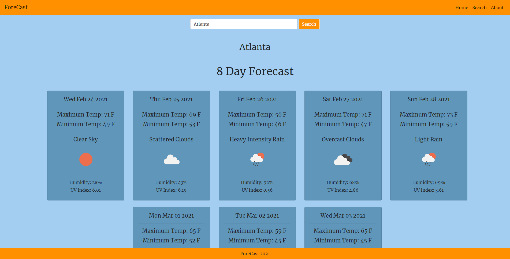
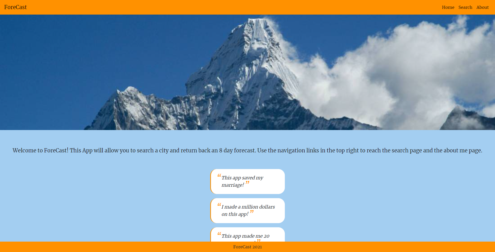

## ForeCast 


## Netlify <https://angry-golick-71d890.netlify.app>


This is app allows the user to search a city and return the 8 day forecast. The information on each card corresponds to one day. The informatio located on each card is the day, max temp, min temp, type of weather, picture of weather, humidity and UV index. 




**How To Use App**


To use this app simply navigate over to the search page via the navbar up at the top. Once in the search page type into the search field the name of the city you wish to look up and press the search button.

**Tech Stack**

- React.js, Redux.js, Bootstrap, CSS
- API : Open Weather API

**MVP & Screen Shots**

My base goal was to give the user the ability to search a city and return the weather results in a clean and clear format.




**Code Snippets**

Grab full details from open movie database:
```
const Search = () => {
  const [inputValue, setInputValue] = React.useState(''); // state , setState
  const dispatch = useDispatch()
  
  const handleSubmit = async(e) => {
    e.preventDefault()
    try {
    let result = await fetch(`${baseUrl}forecast?q=${inputValue}&appid=${appId}`)
    let data =  await result.json();
    console.log(inputValue)
    
    
    if(data?.city?.coord){
      const {
        city: {
          coord: {
            lat, lon
          }
        }
      } = data //object desctructering based off what was in original api pulling out the lat and lon of typed in city
      
      if (lat  && lon) {
        let result = await fetch(`${baseUrl}onecall?lat=${lat}&lon=${lon}&units=imperial&exclude=current,minutely,hourly,alerts&appid=${appId}`)
        let data =  await result.json();
        dispatch(update(data.daily)) 
      }
    }
  } catch (error) {
    console.log("Not a city");
  }
  }
    
    return (
      <>
      
      <div className="">
        <form className="d-flex justify-content-center mt-5" onSubmit={(e) => handleSubmit(e) }>
          <input style={{width: '400px'}} className="form-control mr-1 mt-5" type="search" placeholder="Enter City Name" aria-label="Search" onChange ={(e) => setInputValue(e.target.value)} />
          <button className="btn btn-outline-light mt-5" type="submit">Search</button>
        </form>
      </div>
      <h2 className="text-center mb-5 mt-5">{inputValue}</h2>


    </>
  )
  
}
```

**Developer Team**

- Ian Haddock
